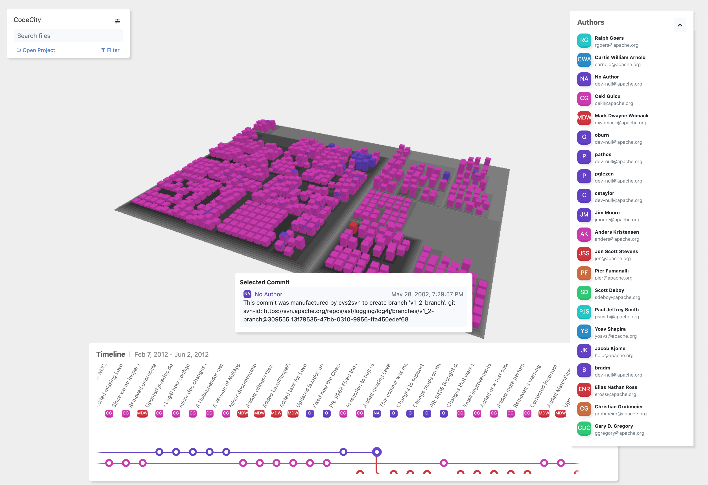

# CoderCity

*Exemplary visualization of log4j project*

This project is a three-dimensional proof of concept visualization, which aims to visualize the Code Ownership metric using the code city metapher, originally developed by Richard Wettel. https://wettel.github.io/codecity.html

Each building represents a file in the visualization, while the height of the building corresponds to the line count of the file. Each folder of the software project is visually represented as a district (platform) and can contain multiple buildings (files). Multiple districts can be stacked on top of each other if a folder contains another folder.

Information of the code ownership is derived using the metadata of each git hunk (See: git blame). Each hunk (visually represented as building segments) is then colored in the representative color of each author. 

For optimal performance, please use Google Chrome.

## Configuration
To start up backend system the environment variable `GIT_PROJECTS_FOLDER:`, which points to a folder with projects initialized with git, must be set:

>      GIT_PROJECTS_FOLDER: /path/to/your/folder/containing/git/projects

The path must not necessary point directly to a single git project, rather it is sufficient to point to a superordinate folder, as the systems will scan for git projects in all sub-directories of the specified folder.
## Build or run
CoderCity can either be run as dockerized application or locally. Please follow the instructions in the segment `Installation` to install the project dependencies before building or running CoderCity.

### Run with Docker
To run with docker, please navigate to the root directory, where the docker-compose.yml file is located and execute:

`docker-compose up`

The system will then be accessible in the webbrowser using the url: `localhost:80`, while the backend system is accessible using `localhost:3000`.

If the docker containers are not already built, docker will proceed with building the system. To manually invoke the build process using docker, excecute:

`docker-compose build`

### Run locally
To run locally, please make sure that the NodeJS and Angular have been installed on your local system.

#### Start up backend system
Navigate to the `backend` folder and install all project dependencies using the command: `npm install`. Once, the dependecies were installed using `npm install`, the command does not have to be excecuted again up until future dependency updates.

To start up the project execute `npm run start:dev`. Please make sure that the environment variable is set, for example using the .env file provided in the backend folder.

The backend system will then be accessible using the url: `localhost:3000`.
#### Start up frontend
Navigate to the `frontend` folder and install all project dependencies using the command: `npm install`. Once, the dependecies were installed using `npm install`, the command does not have to be excecuted again up until future dependency updates.

To start up the project execute `ng serve`.

The frontend system will then be accessible in the webbrowser using the url: `localhost:4200`.
## Implementation
This project was developed using Angular and NestJS (NodeJS).

*Used libraries:*
*Frontend:*
* Akita (State Management)
* SVG.js (SVG Library)

*Backend*
* Nodegit

## Installation
To build or run this project locally, install following dependencies:

## Downloads

### NodeJS
Please install the latest version of NodeJS
https://nodejs.org/en/download/

### Angular CLI
Install Angular CLI, please make sure you have NodeJS already installed prior.
> npm install -g @angular/cli
https://angular.io/guide/setup-local

### Docker
Please install Docker for your operating system, if you wish to build or run the application using Docker.

https://docs.docker.com/desktop/